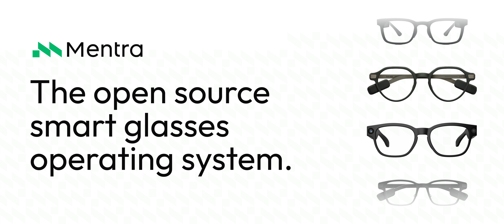
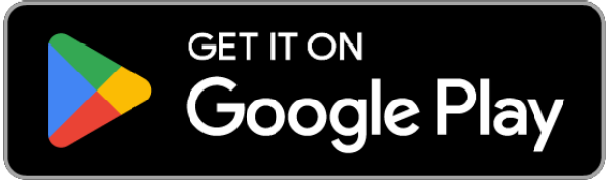
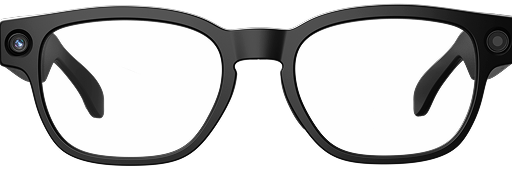
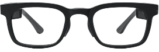
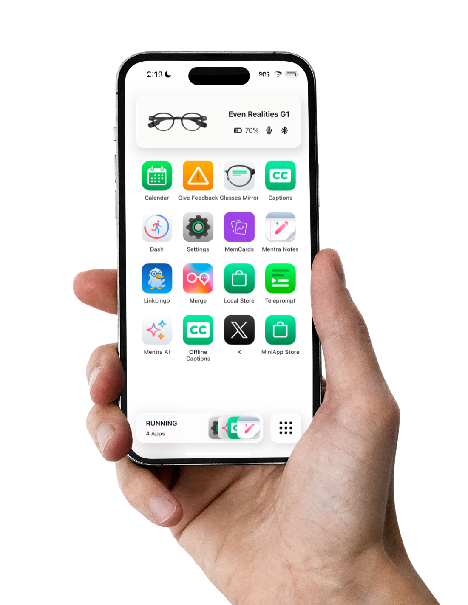
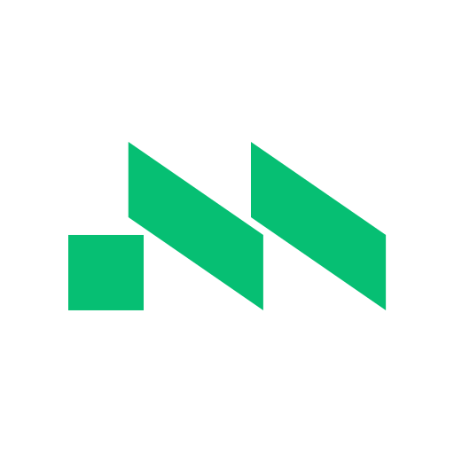

# Veiller

**Veiller** — /VAY-lur/ — from the French *veiller* (Latin *vigilāre*), "to keep
watch, to watch over": it keeps watch at the edge of your vision.

Veiller (formerly **Foverlay**) is a self-hosted Android companion app for the
Even Realities G2 smart glasses, built as a fork of MentraOS (upstream README
below).

---

  

  

    <a href="https://mentra.glass">Website</a> •
    <a href="https://docs.mentra.glass">Documentation</a> •
    <a href="https://console.mentra.glass">Developer Console</a> •
    <a href="https://apps.mentra.glass">Mentra MiniApp Store</a>
  

  <!--
  

    
    
    
    
    
  

  -->

  
  

## Write Once, Run on Any Smart Glasses

MentraOS is how developers and businesses build smart glasses apps.

MentraOS handles pairing, connection, data streaming, hardware access, and cross-device compatibility, so you can focus on building amazing apps. Development goes from months to days.

Every component is open source under the MIT license, giving you privacy, freedom, and control.

## Supported Smart Glasses

MentraOS works across a growing ecosystem of smart glasses.

  <table border="0" cellspacing="0" cellpadding="0" width="100%" style="border: 0 !important; border-collapse: separate; border-spacing: 8px;">
    <tbody>
      <tr style="border: 0 !important; background: transparent;">
        <td align="center" valign="top" width="20%" style="border: 1px solid #e5e7eb; border-radius: 14px; padding: 24px 12px 12px; background: #ffffff;">
           
          
            
          
<b>Mentra Live</b>

        </td>
        <td align="center" valign="top" width="20%" style="border: 1px solid #bbf7d0; border-radius: 14px; padding: 24px 12px 12px; background: #ffffff;">
           
          
            
          
<b>Even Realities G2</b>

        </td>
        <td align="center" valign="top" width="20%" style="border: 1px solid #e5e7eb; border-radius: 14px; padding: 24px 12px 12px; background: #ffffff;">
           
          
            
          
<b>Vuzix Z100</b>

        </td>
        <td align="center" valign="top" width="20%" style="border: 1px solid #e5e7eb; border-radius: 14px; padding: 24px 12px 12px; background: #ffffff;">
           
          
            
          
<b>Even Realities G1</b>

        </td>
        <td align="center" valign="top" width="20%" style="border: 1px solid #fed7aa; border-radius: 14px; padding: 24px 12px 12px; background: #ffffff;">
           
          
            
          
<b>NIMO&nbsp;(Coming&nbsp;Soon)</b>

        </td>
      </tr>
    </tbody>
  </table>

## Why Build with MentraOS?

- **Cross-Compatibility:** Build one app that runs on supported smart glasses from multiple manufacturers.
- **Fast Development:** Go from months of custom smart glasses development to a working app in days.
- **Hardware Access:** Use displays, microphones, cameras, speakers, and everything else smart glasses expose from one API.
- **App Distribution:** Publish to the Mentra MiniApp Store and reach users across the MentraOS ecosystem.
- **Business Deployment:** Deploy smart glasses apps for field work, remote support, training, accessibility, and compliance-sensitive workflows. MentraOS is already being deployed by Fortune 500 companies.
- **Open Source Control:** Own it, host it, modify it, and extend it. MentraOS is MIT-licensed infrastructure designed for privacy, transparency, and freedom from hardware or cloud lock-in.

## Apps on the Mentra MiniApp Store

Browse, install, and run glasses apps from your phone. Try captions, AI notes, proactive AI, translation, streaming, and more.

  

## How MentraOS Works

MentraOS runs glasses apps on the phone inside the Mentra Runtime. Multiple glasses apps can run simultaneously, controlling your smart glasses through one shared connection.

This keeps the glasses lightweight while letting multiple apps run together, like captions, notes, notifications, dashboard, and AI tools. It also allows one app to work with any pair of supported smart glasses.

Manufacturers can integrate the Mentra Runtime into their own iOS and Android apps to unlock the Mentra ecosystem while preserving their brand, app, and customer relationship.

## Nightly Builds

  

    
    
  

## Community

MentraOS is built by developers, companies, and users who believe the next personal computer should be open, cross-compatible, private, and user-controlled.

Join us and become part of the Mentra Community by joining our Discord server:  
[https://mentra.glass/discord](https://mentra.glass/discord)

## Contributing

MentraOS is made by a community and we welcome pull requests.

**Contributor guide:**  
[https://docs.mentraglass.com/os-devs/contributing/overview](https://docs.mentraglass.com/os-devs/contributing/overview)

Looking for ways to contribute? We mark issues we'd love the community to help with using the "Help Wanted" tag.

**Help wanted issues:**  
[https://github.com/Mentra-Community/MentraOS/issues?q=is%3Aissue%20state%3Aopen%20label%3A%22help%20wanted%22](https://github.com/Mentra-Community/MentraOS/issues?q=is%3Aissue%20state%3Aopen%20label%3A%22help%20wanted%22)

## Contact

- **Email:** [team@mentra.glass](mailto:team@mentra.glass)
- **Discord:** [https://mentra.glass/discord](https://mentra.glass/discord)
- **X:** [https://x.com/mentraglass](https://x.com/mentraglass)

## License

MIT License

Copyright 2026 Mentra Labs, Inc.

   
  
  <h3>© 2026 Mentra Labs, Inc.</h3>

