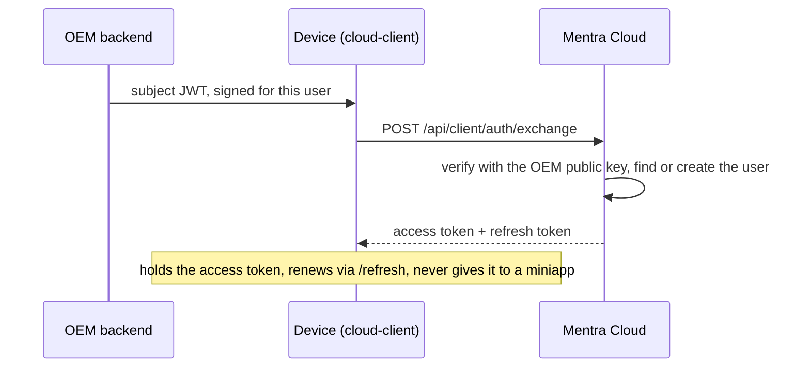
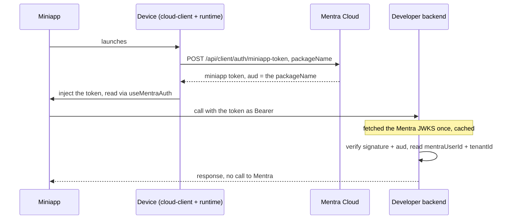

# Auth from zero: a primer

**Status:** Learning doc. Start here if auth is unfamiliar. It teaches the handful
of ideas the rest of this folder assumes (tokens, JWTs, symmetric vs asymmetric
signing, JWKS, audiences, token exchange, refresh), building each from intuition
and mapping it onto the actual MentraOS system. By the end, [`spec.md`](./spec.md)
and [`design.md`](./design.md) should read plainly.

You do not need any crypto background. Where a real standard has a scary name
(RFC 8693, Ed25519), the name is just a label; the idea underneath is simple.

---

## 1. What auth is even for

Two different questions hide under the word "auth":

- **Authentication (authn): who are you?** Proving identity. A login screen.
- **Authorization (authz): what are you allowed to do?** Proving permission.
  "This user can read that file."

Most of this folder is about authentication: when some code calls our backend, we
need to know which user it is acting for, and we need to be sure it is not lying.

The hard part is the "not lying" bit. Anyone can send us an HTTP request claiming
`userId: "alice"`. We need a claim we can **verify** rather than just believe.

## 2. The cast

Five actors show up in every example. Hold this map; the rest of the doc points
at it.

- **The user.** A person wearing glasses, using an app on their phone.
- **The OEM.** A hardware partner who ships their own glasses and their own phone
  app, with their own user accounts. (For Mentra's own app, "the OEM" is just
  Mentra, a reserved special case. Same machinery.)
- **The device / cloud-client.** The code on the phone that talks to our cloud on
  the user's behalf. It holds the user's credential.
- **Mentra Cloud.** Our backend. It issues credentials and verifies them.
- **The miniapp + its developer backend.** A miniapp is a small program that runs
  on the glasses. Some miniapps call a backend the developer runs, and that
  backend wants to know which user it is serving.

The whole system is about getting a trustworthy "this is user X" from the left of
that list to the right, without anyone in the middle being able to forge it.

## 3. A token is a signed note

Forget computers for a second. Imagine a paper note that says "the bearer is
Alice," stamped with a wax seal that only one person owns. Anyone can read the
note. Anyone can check the seal is genuine. Nobody can make a new note with that
seal unless they have the stamp.

A **token** is the digital version. It carries some facts and a cryptographic
"seal" so the reader can confirm it was issued by who it claims, and was not
altered. A token you simply present to prove yourself ("possession = proof") is
called a **bearer token**; it travels in the HTTP header
`Authorization: Bearer <token>`.

That is the core trick of the whole system: instead of asking the issuer "is this
real?" on every request, the issuer signs once, and everyone can check the
signature themselves.

## 4. JWT: what is actually inside the note

The note format we use is a **JWT** (JSON Web Token, pronounced "jot"). It is just
three chunks joined by dots: `header.payload.signature`.

- **Header:** which signing algorithm and which key (`kid`, see below).
- **Payload:** the facts, called **claims**, as plain key/value JSON.
- **Signature:** the seal over header + payload.

The payload is **not secret**: anyone can base64-decode and read it (paste a token
into jwt.io and you will see the JSON). The signature is what makes it
trustworthy, not hidden. So a JWT is "readable by all, forgeable by none."

Here is our real **access token**, decoded (this is the device's main credential):

```json
{
  "sub": "663b1f...e91a",   // mentraUserId: which user (our users._id)
  "tenant_id": "mentra",       // which OEM vouched for them
  "session_id": "...",      // this runtime session
  "aud": "mentra-cloud",    // who this token is FOR (section 7)
  "iss": "mentra-cloud",    // who issued it
  "jti": "...",             // unique id, so a token can be single-use / revoked
  "exp": 1735689600         // expiry, Unix seconds (section 8)
}
```

Standard claim names are three letters by convention: `sub` (subject = the user),
`aud` (audience), `iss` (issuer), `exp` (expiry), `iat` (issued-at), `jti`
(JWT id). The rest (`tenant_id`, `session_id`) are ours. (The miniapp token in
section 7 uses a camelCase `tenantId` and `aud = <packageName>` instead -- that is
a separate token, verified by developer backends, not the device access token.)

## 5. Signing: how a note cannot be forged

A signature is produced by a **key**. There are two families, and the difference
between them is the single most important idea in this folder.

### Symmetric signing (one shared secret)

One secret key both **makes** and **checks** the seal. Like a password both sides
know. The algorithm name you will see is `HS256`.

It is simple and fast. The catch is fatal for our case: **anyone who can verify
can also forge.** If we gave every miniapp developer's backend the shared secret
so they could check our tokens, any one of them could also mint a token for any
user and impersonate them everywhere. The verify power and the forge power are the
same key.

(We still use symmetric signing in one safe spot: tokens that Mentra both issues
and verifies internally, where the secret never leaves us. The v1 "core token" is
HS256. That is fine precisely because nobody outside Mentra ever needs to verify
it.)

### Asymmetric signing (a key pair)

Two **different** keys that are mathematically linked:

- a **private key** that makes the seal, and
- a **public key** that only **checks** it.

You cannot derive the private key from the public key. So:

- **Mentra holds the private key.** Only Mentra can sign. Only Mentra can mint
  tokens.
- **The public key is given to everyone.** Anyone can verify. Nobody else can
  forge.

That asymmetry is the unlock. It lets thousands of miniapp developer backends
**check** that a token is genuinely from Mentra without ever being able to **make**
one. The algorithm we use is **Ed25519** (an `EdDSA` curve); for our purposes it
is just "a fast, modern asymmetric signature." `RS256`/`ES256` are other names in
the same family.

This is why every Mentra-issued token a third party must verify is asymmetric.

## 6. JWKS: publishing the public key

If verifiers need our public key, how do they get it? We could hardcode it into
every SDK, but then rotating the key (replacing it, e.g. if we ever suspect a
leak) would mean shipping a new SDK to everyone. Bad.

Instead we publish public keys at a well-known URL as JSON. The format for one key
is a **JWK** (JSON Web Key); the set of them is a **JWKS** (JWK Set). Ours lives at:

```
GET /.well-known/jwks.json
```

A verifier fetches that once (and caches it), and finds the right key by matching
the token header's **`kid`** ("key id") to a key in the set.

**Rotation falls out for free.** To replace a key, we publish the new one
alongside the old in the JWKS and start signing with the new `kid`. Verifiers pick
the key named in each token's header automatically, so old and new tokens both
verify during the overlap. Once every token signed with the old key has expired,
we drop it. No coordination with clients, ever. We run this from day one.

We deliberately use **two** signing keys (so two `kid`s in the JWKS): one for the
access token, a **separate** one for the miniapp token (next section). Separate
keys mean a problem with one does not blast the other.

## 7. Audience: who a token is *for*

A signature proves a token is genuine. It does **not** prove the token was meant
for *you*. That is the `aud` (audience) claim's job, and it stops a whole class of
attacks.

Concretely, our **miniapp-scoped token** is minted with `aud = <packageName>`,
pinned to exactly one miniapp:

```json
{ "sub": "663b1f...", "tenantId": "mentra",
  "aud": "com.dev.weather",   // valid ONLY for this miniapp's backend
  "iss": "cloud-core", "exp": ... }
```

The weather miniapp's backend, when it verifies a token, checks **both** "is the
signature genuinely Mentra's?" **and** "is `aud` equal to *my* packageName?" So:

- A token minted for `com.dev.weather` cannot be replayed against
  `com.dev.banking`'s backend; that backend sees the wrong `aud` and rejects it,
  even though the signature is perfectly valid. (Prevents **replay** across
  miniapps.)
- The miniapp token cannot be used as the device's access token against our
  runtime either: different signing key, different `aud`. (Prevents **token
  confusion**, using a token in a context it was not issued for.)

Audience pinning is why we can hand a per-user token to a developer's backend
without that token being a skeleton key.

## 8. Why tokens expire, and refresh tokens

Bearer tokens are "possession = proof," so a stolen one is usable until it
expires. We keep that window short: the access token's `exp` is about **1 hour**.

But we do not want the user re-authenticating every hour. So the exchange (next
section) also returns a **refresh token**: a longer-lived credential whose *only*
job is to get a new access token, via `POST /api/client/auth/refresh`. The refresh
token is never sent to resource servers, only to that one endpoint, and each use
**rotates** it (the old one is invalidated). Short-lived access token for everyday
calls, refresh token held quietly to renew it: small theft window, no constant
logins.

## 9. Token exchange: trading someone else's proof for ours

Last idea. An OEM already has its own logged-in user, in its own app, with its own
notion of identity. We do not want the OEM redirecting users to a Mentra login
screen (there is no Mentra UI in their product). We just need the OEM to **vouch**
for the user, server-side, and we turn that into a Mentra credential.

The standard for "present a token from issuer A, get back a token from issuer B"
is **token exchange (RFC 8693)**. The flow:

1. The OEM's backend signs a short-lived JWT saying "this is my user `tenantUserId`"
   (the **subject token**), using the OEM's own private key.
2. The device hands that subject token to `POST /api/client/auth/exchange`.
3. Mentra verifies it against the OEM's **registered public key** (same
   asymmetric idea, in the other direction: the OEM signs, Mentra verifies), maps
   `(tenantId, tenantUserId)` to a Mentra user, and returns **our** access + refresh
   tokens.

From that point on the device carries a Mentra-issued credential, and the OEM's
backend is out of the per-request path entirely. The same endpoint also accepts
Mentra's own subject tokens (the v1 core token during transition, a Supabase
session in the end state); the `subject_token_type` selects the verification path.
Mentra-direct users are just the reserved OEM `"mentra"`.

## 10. One full trace, using everything above

A user of an OEM's glasses opens a weather miniapp that calls the developer's
backend. Watch each concept fire.

1. **The user is already signed in to the OEM's app.** No Mentra login.
2. **Vouch (exchange, asymmetric, RFC 8693).** The OEM backend signs a subject
   JWT for this user. The cloud-client sends it to `/api/client/auth/exchange`.
   Mentra verifies it with the OEM's public key, finds-or-creates the user, and
   returns a **Core access token** (`aud = "cloud-core"`, `sub = mentraUserId`,
   ~1h) plus a **refresh token**.
3. **The device holds the Core access token** and renews it via `/refresh` as needed.
   This token is **never** handed to a miniapp.
4. **Per-miniapp mint (audience).** When the weather miniapp launches, the
   cloud-client calls `/api/client/auth/miniapp-token` with `packageName`. It gets
   back a **miniapp-scoped token** with `aud = com.dev.weather`, signed with the
   separate miniapp key.
5. **Injection.** The on-device runtime hands that one token to the miniapp;
   `useMentraAuth()` exposes it. The miniapp sees only its own scoped token.
6. **The miniapp calls its backend** with `Authorization: Bearer <miniapp token>`.
7. **The backend verifies, alone (JWKS, aud).** It fetched Mentra's
   `/.well-known/jwks.json` once, picks the key by `kid`, checks the signature is
   Mentra's, checks `aud == com.dev.weather`, and reads `mentraUserId` + `tenantId`.
   It never calls Mentra per request, and it could never forge a token because it
   only holds public keys.

Every idea in this primer is in that trace: signed tokens (3), JWT claims (5),
asymmetric signing both directions (2, 7), JWKS + `kid` (7), audience pinning (4,
7), expiry + refresh (3), token exchange (2).

The flow has two parts. First the device authenticates once and the cloud-client gets
a Core access token. Then, for each miniapp, that Core token is turned into a scoped
token the miniapp's own backend can verify by itself. Runtime live services use a
separate `cloud-runtime` audience token; see issue 007.

**Part 1: the device authenticates (cloud-client auth).** The cloud-client trades the
OEM's vouch for Core-backed credentials, once.



**Part 2: a miniapp gets auto-authed (the device is already authed).** For each
miniapp, the cloud-client mints a scoped token; the miniapp's backend verifies it on
its own via JWKS.



## 11. Quick reference

| Term | One line |
| --- | --- |
| Authentication / Authorization | Who you are / what you may do. |
| JWT | A signed JSON note: `header.payload.signature`, readable by all. |
| Claims | The key/values in a JWT (`sub`, `aud`, `exp`, ...). |
| Bearer token | Possession is proof; sent as `Authorization: Bearer`. |
| Symmetric (HS256) | One shared secret signs and verifies. Verifier can forge. |
| Asymmetric (Ed25519) | Private key signs, public key only verifies. Verifier cannot forge. |
| JWK / JWKS | A public key as JSON / the set of them, published at a URL. |
| `kid` | Key id in a token header; selects which JWKS key verifies it. |
| Rotation | Publish new key beside old, swap signing, drop old after overlap. |
| `aud` (audience) | Who a token is for; verifier rejects a wrong-audience token. |
| Access token | Short-lived (~1h) credential for everyday calls. |
| Refresh token | Long-lived, renews access tokens, never sent elsewhere, rotates on use. |
| Token exchange (RFC 8693) | Trade issuer A's token for issuer B's. |
| Subject token | The incoming token you present to the exchange (e.g. the OEM's JWT). |

For the multi-tenant / OEM research that led to choosing token exchange, see the
deeper [`oem-auth.md`](./oem-auth.md).

## 12. Where to go next

- [`spec.md`](./spec.md): the concrete endpoints and token shapes. Every term in
  it is defined above.
- [`design.md`](./design.md): how it is built across cloud-core, the cloud-client,
  on-device, and the developer SDK. Includes the identity model (who
  `mentraUserId` is, the v1 to v2 bridge) and the miniapp auto-auth + on-device
  injection flow.
- [`oem-auth.md`](./oem-auth.md): the built OEM-exchange subsystem.
