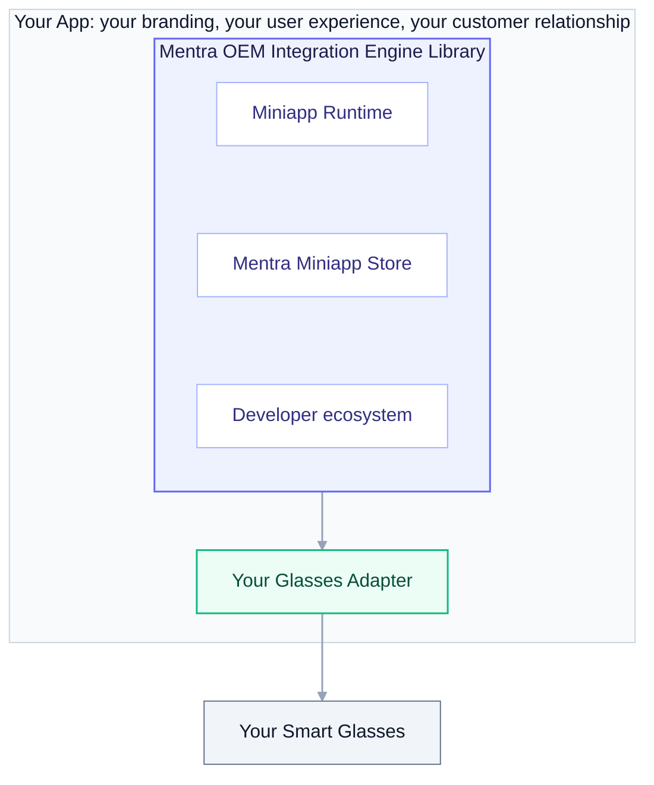

## What it is

The **Mentra OEM Integration Engine** is all of MentraOS's phone-side logic packaged as a library you embed in your **own** app. Your users stay in your app and on your brand, but they get the full MentraOS experience: the Mentra Miniapp Store, installable miniapps, and the same developer ecosystem that powers the Mentra App.

The engine owns everything between your glasses and Mentra's backend services:

- **Mentra Miniapp Store + runtime**: discover, install, and run miniapps on the phone.
- **Glasses I/O**: display rendering, microphone/audio routing, and the rest of the glasses feature set.
- **Backend connectivity**: talking to Mentra's backend services for the store, transcription, translation, streaming, and photos.

You bring two things: **your glasses** (and however you talk to them over Bluetooth) and **your app** (its shell, navigation, and branding).



## Integrating in four moves

### 1. Install the engine

Add the engine to your app, using the path that matches how your app is built:

- **React Native / Expo**: install the engine as a module.
- **Native (iOS / Android)**: embed the native libraries (iOS framework, Android library) directly.
- **Flutter**: embed the native libraries and bridge them into Flutter through platform channels.

### 2. Configure the engine

You give the engine a single configuration when your app boots. The engine manages its own settings internally. The only things you hand it are what's yours:

- **Your identity**: how your users are signed in (see [Backend connectivity](#3-connect-to-the-backend-services)).
- **Optional proxy**: if you route Mentra's backend services through your own infrastructure, you pass your proxy here (see below).

### 3. Connect to the backend services

The engine talks to two tiers of Mentra backend services:

- **Mentra Runtime Services.** The capabilities the engine relies on: speech-to-text, text-to-speech, translation, live streaming, and photo handling. Self-hostable and/or proxyable (run your own, route through your proxy, or both).
- **Mentra Cloud Core Services.** The Mentra Miniapp Store, the developer console, and the OEM APIs. Proxyable only (always Mentra-hosted, optionally reached through your proxy).

The engine also includes **on-device STT/TTS** as a fallback for offline or degraded-network scenarios. Cloud STT/TTS is the recommended path for production quality; on-device is the safety net.

**Identity.** Your users sign in through *your* identity system. They never create a Mentra account. The engine exchanges your app's signed-in identity for a Mentra-scoped session, so your users see only your login.

**Routing through your proxy.** You don't stand up a separate proxy service. When you configure the engine, you give it your proxy details and it routes all backend traffic through your infrastructure. Without a proxy, the engine talks to the backend services directly.

### 4. Register your glasses

The engine talks to glasses through a **Glasses Adapter**: a contract that describes one model of glasses. You implement an adapter for your hardware, in your own app, against your own Bluetooth stack, and register it at startup. The engine then treats your glasses as a first-class device, exactly like the glasses Mentra ships.

An adapter declares two things: **capabilities** (what your glasses have) and **behavior** (how to drive each feature over your BLE link). You declare and implement only what your hardware actually has.

**Example: a display + mic device with a touchpad and an IMU (no camera).** This is the common OEM shape today (think Even Realities G2): a monochrome text display, a microphone, a capacitive touchpad, and an IMU, no camera. Here's the whole adapter for one.

**Declare your capabilities.** Same capability shape the engine uses for every device it supports. Fill it in for your hardware. This device declares a display, a microphone, an input surface, and an IMU, and leaves the rest out:

```ts
const capabilities: Capabilities = {
  modelName: "Acme Vision One",

  display: {
    ocularity: "binocular",   // "monocular" | "binocular"
    isColor: false,
    color: "green",
    canDisplayBitmap: true,
    resolution: {width: 640, height: 200},
    maxTextLines: 5,
    adjustBrightness: true,
  },

  microphone: {count: 1, hasVAD: false},

  input: {
    surfaces: [{kind: "touchpad"}, {kind: "button"}],
    events: ["tap", "double_tap", "triple_tap", "long_press", "swipe_up", "swipe_down"],
  },

  imu: {hasAccelerometer: true, hasGyroscope: true, hasCompass: true},

  power: {hasExternalBattery: false},

  // A capability the device doesn't have is null.
  camera: null,
  speaker: null,
  light: null,
  wifi: null,
}
```

**Implement the behavior.** Each method drives your hardware over your BLE link. The engine never calls a method for a capability you didn't declare:

```ts
const acmeAdapter: GlassesAdapter = {
  model: "Acme Vision One",
  capabilities,
  displayProfile: acmeDisplayProfile,   // how your screen renders text (size, monochrome)

  // Connection lifecycle
  async scan(onFound)      { /* discover your glasses over BLE; call onFound per device */ return stopScan },
  async connect(device)    { /* your BLE connect */ },
  async disconnect()       { /* your BLE disconnect */ },
  async forget()           { /* unpair / clear the bond */ },
  onStatusChange(cb)       { /* connected, battery, firmware version, etc. */ return unsubscribe },

  // Display
  async displayText(text)            { /* push a text wall */ },
  async displayDoubleText(top, bot)  { /* two-region text layout */ },
  async displayBitmap(bmp)           { /* push a bitmap */ },
  async clearDisplay()               { /* clear the screen */ },
  async setBrightness(n, auto)       { /* set brightness (or auto) */ },
  async setHeadUpAngle(deg)          { /* angle at which content shows on head-up */ },

  // Dashboard (a built-in overlay the engine drives)
  async showDashboard()              { /* show the dashboard overlay */ },
  async setDashboardMenu(items)      { /* set dashboard menu entries */ },
  async setDashboardPosition(h, d)   { /* position the dashboard */ },

  // Microphone
  async setMicEnabled(on)  { /* turn the mic on/off */ },
  onAudio(cb)              { /* stream mic audio up to the engine */ return unsubscribe },

  // Input (touchpad + buttons)
  onInputEvent(cb)         { /* report any declared input event: taps, swipes, presses */ return unsubscribe },

  // IMU (sensor feed, not input)
  async setImuEnabled(on)  { /* start/stop the IMU feed */ },
  onImuData(cb)            { /* stream orientation / motion when a miniapp subscribes */ return unsubscribe },
}

registerGlassesAdapter(acmeAdapter)
```

That's the whole integration. The engine handles everything above it: which miniapps run, how their content is laid out for your screen, routing your mic audio to speech-to-text.

Your adapter lives **in your app**: your Bluetooth protocol, your firmware, your transport stay private to you. You never submit glasses code to Mentra, and you never wait on a Mentra release to ship a hardware change.

## Why this works

- **Your hardware, no fork.** The Glasses Adapter is your private extension point. Add or change a model entirely within your app.
- **Your app, your brand.** Users never leave your app or see a Mentra account. The engine is a library inside your experience, not a separate app.
- **One shared ecosystem.** Every OEM's users and developers live in the same MentraOS ecosystem. That's what makes the Mentra Miniapp Store worth being part of.
- **You decide what you host.** Use Mentra's backend services as-is or route them all through your own proxy.

## Availability

The Mentra OEM Integration Engine is planned for release by the **end of 2026**. To start an integration, reach out to [help@mentra.glass](mailto:help@mentra.glass).
